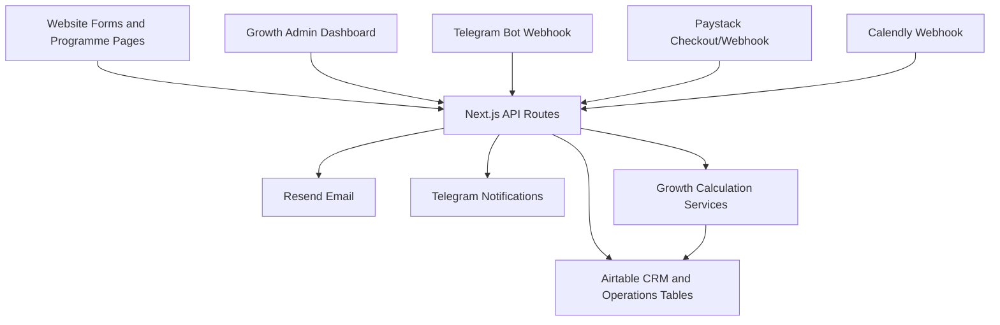

# Existing System Audit

Date: 2026-07-22

## Current architecture

### Frontend

The site is a Next.js 15 App Router application using TypeScript, React 19, Tailwind CSS, Framer Motion, and lucide-react icons. Public pages live under `src/app`, with reusable UI in `src/components`.

Important public workflows:

- Career Accelerator pages: `/career-accelerator` and `/career-accelerator/[track]`
- Business Transformation pages: `/business-transformation` and `/business-ai-transformation`
- Growth Associate recruitment: `/growth-associate/recruitment` and `/ambassadors/apply`
- Growth Associate admin: `/growth-associate/admin`

### Backend

The backend is implemented as Next.js route handlers under `src/app/api`.

Important APIs:

- `/api/ambassadors/register`
- `/api/growth-associate/admin`
- `/api/growth-associate/calendly`
- `/api/growth/daily-leads`
- `/api/leads/capture`
- `/api/paystack/initialize`
- `/api/paystack/webhook`
- `/api/telegram/webhook`
- `/api/telegram/send-queue`
- `/api/telegram/health`
- `/api/conversations/inbound`
- `/api/website/forms`

### Database

There is no local SQL database, Prisma schema, Supabase schema, or migration folder. Airtable is the current operational datastore.

The shared Airtable helper is `src/lib/airtable.ts`. It supports listing, creating, and updating records through the Airtable REST API. Existing scripts use the Airtable Metadata API to create or extend tables.

### Hosting

The site is deployed on Render as a Node web service. Deployment configuration exists in `render.yaml`.

### External integrations

- Airtable: CRM and operational data.
- Paystack: checkout initialization and payment webhook.
- Telegram: inbound lead capture, admin notifications, and daily lead digest.
- Resend: email delivery for Growth Associate recruitment actions.
- Calendly: interview scheduling webhook and interview invite link.

### Authentication

There is no full user authentication system. Current protection is based on shared secrets:

- `GROWTH_ADMIN_SECRET` protects the Growth Associate admin API and dashboard fetches.
- `TELEGRAM_WEBHOOK_SECRET` protects Telegram webhook calls when configured.
- `TELEGRAM_QUEUE_SECRET` or `CRON_SECRET` protects queue/digest actions.
- Paystack webhooks are protected by signature verification.

### User roles

Roles are implicit, not modeled as first-class users:

- Admin: anyone with `GROWTH_ADMIN_SECRET`.
- Telegram admin: configured via `TELEGRAM_ADMIN_CHAT_ID`.
- Growth Associate: represented by Airtable `Ambassadors` records after approval.
- Applicant: represented by Airtable `Ambassador Registrations`.

There is not yet an associate login or associate-only dashboard.

### API patterns

APIs are direct Next.js route handlers. Airtable errors are usually caught at the route level. Most writes are immediate REST writes to Airtable. There is no queue worker except Airtable `Conversation Message Queue` records used by Telegram send flow.

### State management

Frontend state is local React state. The admin dashboard stores the admin secret in browser local storage.

### Background jobs

No persistent scheduler exists in the repository. The daily lead digest endpoint is designed to be called externally by cron/Render/Codex/manual trigger.

### Reporting capability

Reporting is limited. The existing Growth Associate admin dashboard reports recruitment records only. There is no full growth operations dashboard for lead assignment, activity tracking, attribution, monthly targets, leaderboard, or bonuses.

## Existing associate lifecycle

Current implemented flow:

```text
Application
-> Admin review
-> Interview scheduling
-> Interview outcome
-> Approval
-> Official Ambassador/Growth Associate record
-> Referral code
-> Referral link
```

Current stage support:

- Application: works through `/api/ambassadors/register`.
- Screening: partial; basic contact-profile scoring exists in `src/lib/growth-associate.ts`.
- Interview selection: works through admin action `schedule_interview`.
- Interview scheduling: partial; email sends Calendly link and `/api/growth-associate/calendly` can update records from Calendly.
- Interview outcome: works through admin actions `pass_interview` and `reject`.
- Approval: works when admin marks `Interview Passed`.
- Onboarding: partial; WhatsApp group invite is sent by email after interview pass.
- Associate account: not implemented as login/account.
- Referral code: works when official associate is created.
- Referral link: works for Career Accelerator using `?ref=CODE`.

## Existing data models

The current Airtable tables used by the code include:

- `Ambassador Registrations`: Growth Associate applicant/recruitment records.
- `Ambassadors`: official Growth Associate/ambassador records.
- `Master Contacts`: lead/contact source of truth.
- `Programmes`: programme records.
- `NGTP Applications`: application records created before checkout.
- `Enrollments`: created/updated after successful Paystack payment.
- `Payments`: created/updated after successful Paystack payment.
- `Website Payment Events`: checkout initialization and Paystack verification status.
- `Ambassador Referrals`: referral and commission records.
- `Lead Source Attributions`: lead source/referral metadata.
- `Lead Capture Conversations`: omnichannel lead qualification conversations.
- `Conversation Message Queue`: outbound message queue records.
- `Conversation Routing Rules`: optional routing rules for lead conversation flow.
- `Growth Leads`: daily business lead digest source table.
- `Business Participants`: Business Transformation participant records.
- `Business Deliverables`: Business Transformation deliverable tracker.
- `Payment Plans`: payment-plan lookup by amount.

There is no explicit table yet for:

- Associate lead assignments.
- Lead activities with verification type.
- Referral event stream.
- Conversion attribution conflicts.
- Monthly performance snapshots.
- Bonus configurations.
- Bonus awards.
- Audit logs.

## Existing integrations

### Airtable

Airtable is currently both source of truth and operational store. It stores recruitment, contacts, applications, payments, enrollments, programme records, referral records, and business deliverables.

### Paystack

`/api/paystack/initialize` creates lead/contact/application/payment-event records, passes metadata to Paystack, and optionally creates pending referral records. `/api/paystack/webhook` verifies Paystack signature and transaction status, prevents duplicate payment creation by checking payment reference, updates payment events, enrollments, payments, contacts, business deliverables, and referral records.

Current metadata includes referral code, ambassador record id, commission data, programme code, selected tracks/programmes, source page, and business metadata.

### Telegram

`/api/telegram/webhook` routes inbound Telegram messages into the existing conversation engine. `/api/growth/daily-leads` sends a daily lead digest to the admin chat. Telegram is not yet role-aware for multiple associates.

### Email

Growth Associate admin actions send applicant emails through Resend via `src/lib/email.ts`.

### Website forms

Public website forms create Airtable records and/or initialize Paystack payment. Referral code is preserved from query parameters in the Career Accelerator selection form and sent into Paystack metadata.

## Gaps and risks

- Airtable is used for both CRM and operational events; high-volume activity will become slow and expensive without a dedicated event store later.
- No first-class user/auth system exists. Admin and associate access depend on shared secrets or Telegram chat IDs.
- Associate identity is split conceptually between `Ambassador Registrations` and `Ambassadors`; official activation links them through `Created Ambassador`.
- No lead assignment table exists.
- No activity timeline with `SYSTEM_VERIFIED`, `ASSOCIATE_REPORTED`, or `ADMIN_CONFIRMED` exists.
- Referral attribution is partially preserved through URL/form/Paystack metadata but referral click events are not yet tracked.
- Paystack webhook is idempotent for `Payments` via payment reference, but not all downstream summary calculations exist yet.
- No attribution conflict handling exists when assigned associate and referral-code associate differ.
- No monthly targets, ranking, or bonus configuration tables exist yet.
- No audit log exists for admin adjustments or bonus decisions.
- No automated tests exist beyond TypeScript and production build.
- No migration framework exists. Airtable schema changes must be versioned as safe scripts.
- Admin dashboard exposes recruitment data only.
- Associate dashboard does not exist.
- Telegram does not yet distinguish admin vs associate commands.
- Several secrets are required for production; they are not stored in source, which is good, but local operation depends on `.env.local`.

## Integration recommendation

Recommendation: **B. Add modules within existing backend**

Reason:

The current project already owns the website, forms, recruitment workflow, Telegram entrypoint, Paystack integration, and Airtable CRM. A separate service would create duplicate identity and attribution risk. The safest next step is to add growth operations modules inside the existing Next.js backend while keeping Airtable as the operational store for MVP. The new modules should be written so a future PostgreSQL/Supabase migration can move high-volume event tables without changing public workflows.

## Architecture diagram


